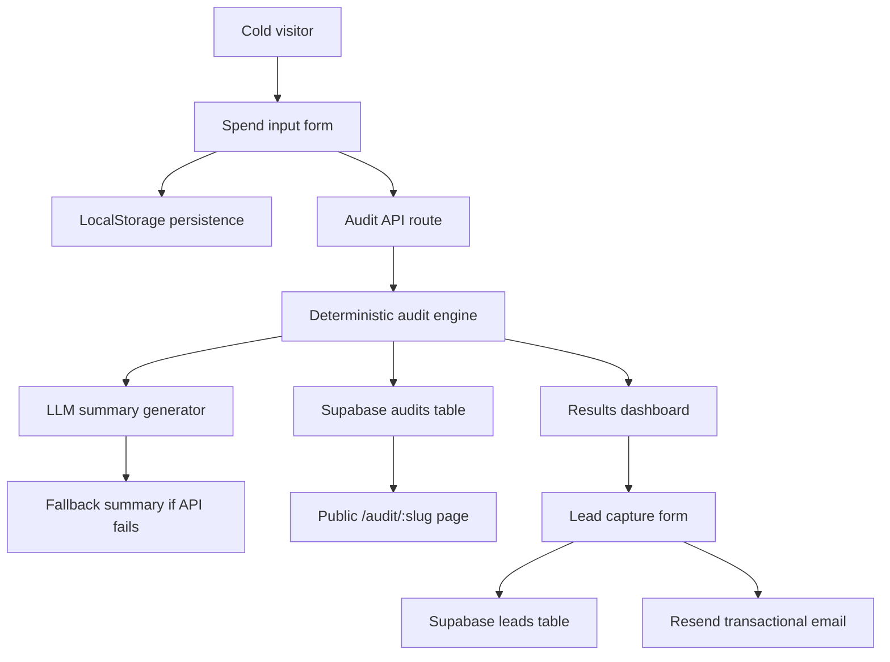

# Architecture

## Data flow

A user enters team size, use case, tool, plan, seats, and monthly spend. The client stores form state in localStorage so refreshes do not wipe progress. On submit, the API route runs the deterministic audit engine, calculates savings, asks the LLM for a short personalized summary, falls back safely if the API fails, stores the audit, and returns the result to the UI.

## Stack choice

I chose Next.js, React, TypeScript, and Tailwind because this assignment needs a polished landing page, API routes, Open Graph metadata, shareable URLs, and fast deployment. TypeScript makes the audit inputs and recommendation outputs safer to refactor.

## Scaling to 10k audits/day

I would move rate limiting to Upstash Redis or Cloudflare Turnstile, queue LLM summaries, cache pricing data, split audit and lead tables with indexes on slug/email, and add observability around API failures and conversion events.
